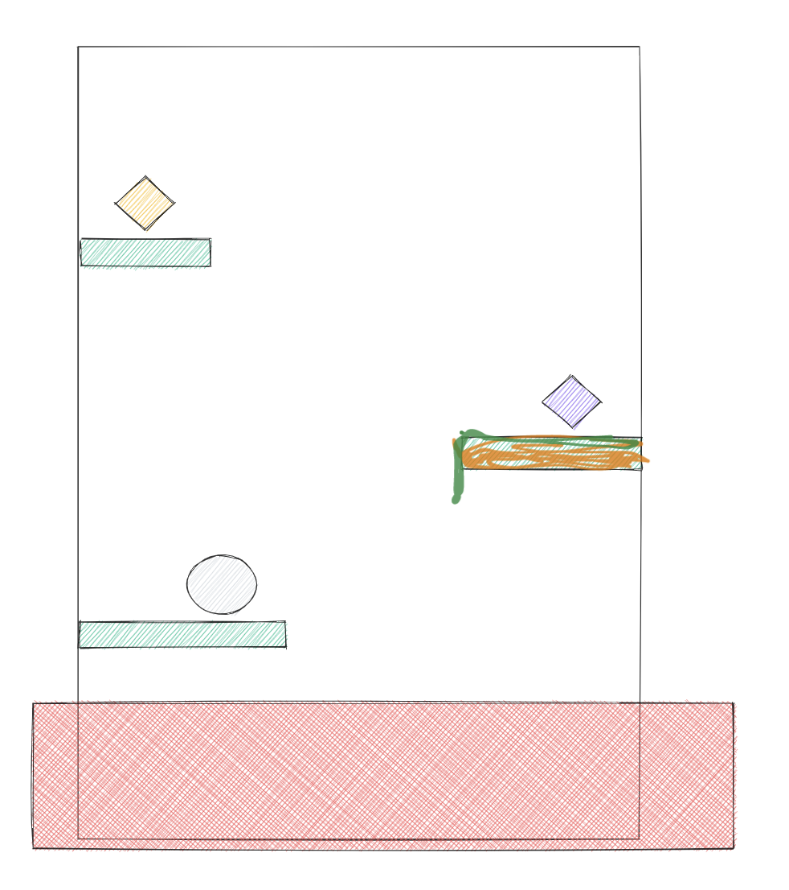

# Как запустить?
```shell
# Клониурем репозиторий
git clone

# Устанавливаем свой емейл и имя, которые вы используете в GitHub
git config --local user.name "Andrew Laskevych"
git config --local user.email tes@gmail.com

# Переходим в папку с raylib
cd resources/framework/raylib/src
 
# Компилируем библиотеку
make

# Возвращаемся в папку с проектом
cd ../../../../

# Компилируем игру для MacOS или Linux
make macos | make linux

# Запускаем игру
./endgame
```

# Как работать с Pull Requests
- Обновляем свою локальную ветку `main`
- `git status` - чтобы убедиться, что вы на ветке `main`
- `git pull`
- `git checkout -b название_ветки_с_фичей` - создаем новую ветку
- `git status` - убеждаемся, что мы на нашей новой ветке
- Добавляем изменения
- `git add` - добавляем файлы в индекс
- `git commit -m` Коммит
- `git push origin название_ветки_с_фичей`
- Переходим на GitHub и создаем Pull Request.

# Механики
- У нас вертикальный уровень, где персонаж движется только вверх по платформам.
- Персонаж может собирать какие-то сущности (монетки), которые могут:
    - положительно
        - увеличение высоты прыжка (100 -> 200)
        - двойной или тройной прыжок
    - негативно
        - "лава" поднимается быстрее
    - Бафы или дебафы (монетки) пропадают после использования
- Персонаж может умереть, если будет касание с "лавой" каким-то объектом, который постепенно поднимается от начала карты
- Платформы могут быть:
    - статичные
    - динамические - двигаются в стороны
    - исчезающие - если персонаж стоит на них больше N секунд, могут ломаться от кол-во интеграций с платформой.

# Как проиграть?
- Соприкасание с лавой
- Платформы с шипами
- Платформы очень хлипкие, которые сразу ломаются

# Сеттинг
- Главный персонаж - обезьянка, которая собирает бананы, убегает от льва и прыгает по лианам.
- Главный персонаж - искатель сокровищ, который взял главное сокровище из гробницы. Активировалась ловушка и пошла лава. Ему нужно убежать.

# Начало игры и история
- Сделать начальный экран в виде картинок-анимаций, где рассказать:
  - историю
  - цель
  - управление
  - землетресение
- Сделать стартовый экран, который интерактивный с игрой.
  - Персонаж не может прыгать, но может взять корону.
  - Он берет корону и говорит фразу "Что-то не так с гробницей. Нужно убеагать"
  - Игра началась
- Идея Дениса
  - Сделать 1 экран с картиной и историей
  - Сделать 2 экран с управлением и кнопкой "Старт"
  - Еще отчет 3, 2, 1

